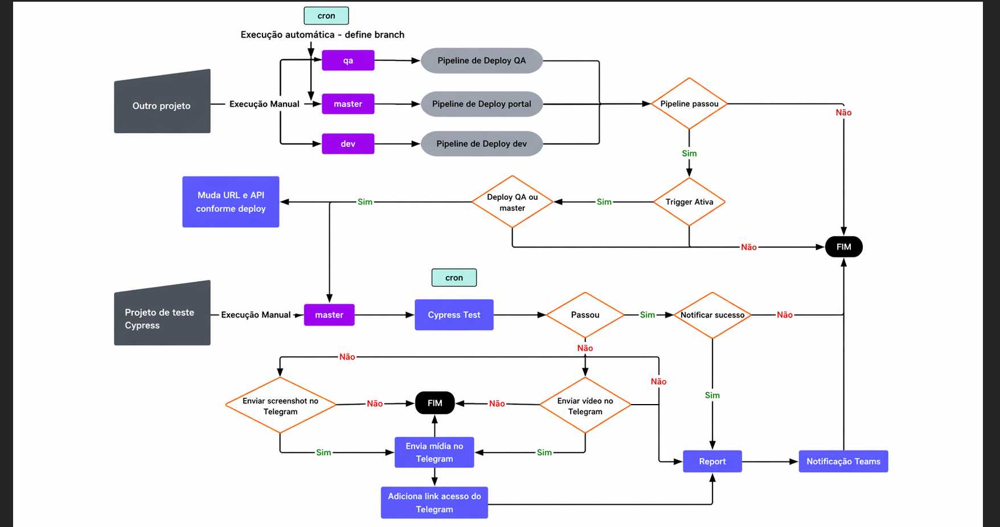

### 🚀 Projeto de automação de testes utilizando:

- Cypress (backend e frontend);   
- CI/CD: Azure DevOps;   
- Notificações: Telegram e Teams;   
- Variáveis via Library (.env no localhost);   
- Execução automática por branch (QA/ Master);   
- Publicação de documentação de API.


>> Este repositório é uma versão adaptada para portfólio, sem dados sensíveis.

### 🗂️ Pasta temp:
Para evitar múltiplos logins:   

- Verifica se existe token em fixtures/tmp/
- Caso não exista → cria arquivo:   
```
login_${usuario}_hash[${hash}].json
```

### 🗂️ Estrutura do Projeto:   
- fixtures: Os fixtures são arquivos com dados que são utilizados pelos testes;   
- plugins: Plugins do Cypress usados para estender as funcionalidades da ferramenta;   
- suporte: Arquivos de configurações e funções auxiliares.   
```
📦 projeto/   
 ┣ 📂 cypress/   
 ┃ ┣ 📂 e2e/           # Aqui ficam os testes   
 ┃ ┣ 📂 fixtures/      # Arquivos utilizados nos testes   
 ┃ ┃ ┗ 📂 geral/   
 ┃ ┃ ┃ ┗ 📂 tmp/   
 ┃ ┃ ┗ 📂 notify/   
 ┃ ┃ ┃ ┗ 📂 teams/   
 ┃ ┣ 📂 results/   
 ┃ ┃ ┗ 📂 doc/   
 ┃ ┃    ┣ api-doc.json # Gera json quando roda o teste no cypress
 ┃ ┃    ┗ api-doc.md   # Transforma o arquivo .json em um arquivo markdown - quando roda o sript generate   
 ┃ ┣ 📂 scripts/          
 ┃   ┗ generate-doc.ts   # Script que gera documentação   
 ┃ ┣ 📂 support/       # Commands e locators, utilizados nos testes   
 ┃ ┗ 📂 pipeline/           # Arquivo de pipelize do Azure Devops   
 ┃ ┃    ┗ azp-cypress-test.yml
 ┣ package.json   
 ┣ cypress.env.example.json   # Exemplo de cypress.env.json esperado
 ┣ reporter-config.json   
 ┗ tsconfig.json   
```

### ⚙️ Pré-requisitos:   
Antes de iniciar, certifique-se de ter instalado:

- Git
- Node.js (recomendado: v18+)
- Cypress
- Editor de código (ex: VS Code)

### ⚙️ Instalação:   
```
  git clone <repo-url>
  cd <repo>
  npm install
```

### ▶️ Execução dos Testes:   
Para abrir o cypress e executar:   
```
npx cypress open
```   
Ou modo headless:   
```
npx cypress run
```

### 🧪 Schema Validation:
Exemplo de schema para validação
```
{
  "openapi": "3.0.0",
  "info": {
    "title": "JSONPlaceholder API",
    "description": "Schema definition for the /endpoint",
    "version": "1.0.0"
  },
  "paths": {
    "/endpoint": {
      "get": {
        "summary": "Get",
        "description": "some description",
        "responses": {
          "200": {
            "description": "A successful response",
            "schema": {
              "type": "array",
              "items": {
                "type": "object",
                "properties": { },
                "required": [ ]
              }
            }
          }
        }
      }
    }
  }
}
```

### 🚀 Criar novo teste de API:
Estrutura inicial do teste de API:
```
const usr = Cypress.env("USERNAME");
const email = Cypress.env("EMAIL");
const passwd = Cypress.env("PASSWD");

describe('Aglutinador de teste de API', () => {

    beforeEach(() => {
        cy.ensureSession(usr, email, passwd, false)
    })

    it('do something', () => {
      cy
        .fixture(fxAddress.PATH_TO_SCHEMA_ADDRESS)
        .then((schema) => {
          cy
            .do_something_commands()
            .then(response => {
              const responseBody = response.body;

              check_status_code(response.status, 200, "/endpoint")
              check_schema_validator(responseBody, schema, '/endpoint')
            })
        });
    });
});
```

## 📄 Documentação de Testes de API

Caso seja necessário gerar documentação para os testes de API, utilize a task `saveApiDocs()`.

Basta informar os dados necessários para documentar o endpoint específico dentro do teste.

Ao executar os testes de API:

- A documentação será gerada automaticamente na pasta /doc, arquivo json;
- No localhost é possível gerar a documentação em markdown, rodando o script _generate-md.ts_;   
- O processo de publicação acontece na pipeline.
  


##### Exemplo de test de API com saveApiDocs:
```
Cypress.Commands.add("do_something", () => {   
  const path = "/path/to/save/doc";   
	const method = "GET";   
	const url = "/endpoint";   
	const headers = {   
		"Content-Type": "application/json",   
		"Authorization": `Bearer ${Cypress.env("accessToken")}`   
	}
    const headersDoc = {   
      "Content-Type": "application/json",   
      "Authorization": "Bearer {accessToken}"   
    }   

    const queryString = {
      "size": 10,
      "page": 1
    }   
    const body = {
      "foo": "bar"
    }   
   
	cy.task("saveApiDocs", {   
		path: path,   
		method: method,   
		url: url,   
		headers: headersDoc,   
		body: body,   
        queryString: queryString   
	});   
   
	return cy.api({   
		method: method,   
		url: '${Cypress.env("BASE_URL_API")}${url}',   
		body: body,   
		headers: headers,   
        qs: queryString 
	})
})   
```

## 🔄 Execução da Pipeline

A pipeline pode ser configurada para iniciar automaticamente em diferentes cenários:

- 🔗 **Execução encadeada (trigger por outra pipeline):**  
  A pipeline pode ser disparada após a finalização de outra pipeline.

- ⏰ **Execução agendada (CRON):**  
  Também é possível configurar um agendamento para execução automática em horários definidos.

## Fluxo da Pipeline




